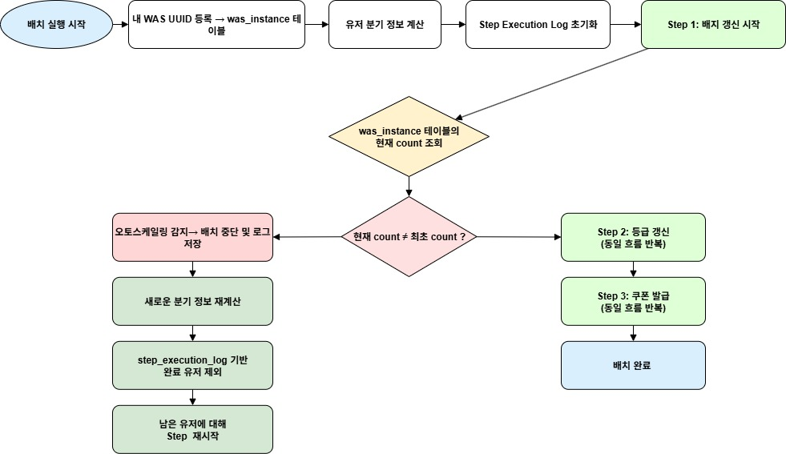
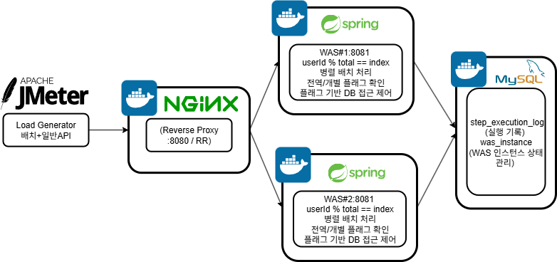

# No Redis, No Problem
### 제한된 인프라에서 고성능·고정합성 시스템을 실현한 실험형 백엔드 구조 설계

> 이 프로젝트는 단순한 서비스 구현이 아닌, **제약된 조건에서 최적의 설계를 도출하는 실험형 포트폴리오**입니다.  
> Redis, Kafka, 분산락 없이도 **실시간 API와 배치가 공존하는 고성능 시스템을 설계할 수 있는가**를 검증하고자 했습니다.
    

###  **핵심 성과** 
#### 1. 배치 처리 성능 98% 개선 (81.48분 → 1.3분)
####  2.  실시간 API 평균 응답속도 최대 96% 단축 (22.4s → 0.43s), 오류율 50% → 0%
#### 3. Redis 없이도 Multi-WAS 환경에서  테스트 시나리오에서 정합성 충돌 0건 실현


## 🛠 기술 스택 및 실행 환경

| 구분         | 스택 / 도구                      |
|--------------|-------------------------------|
| Language     | Java 17                       |
| Framework    | Spring Boot 3, MyBatis        |
| DB           | MySQL 8 (InnoDB)              |
| Infra        | Docker, Nginx (Reverse Proxy), JMeter |
| 테스트/모니터링 | Apache JMeter, Docker Logs     |
| 기타         | UUID 기반 PK 전략, 멀티 스레드 병렬 처리, 무 Redis 구조 |


---

## 📌 1. 프로젝트 목표 및 핵심 과제

#### 본 프로젝트는 다음과 같은 목표를 가지고 시작되었습니다.
* **대용량 데이터 배치 처리:** 사용자 3만 명, 주문 100만 건에 대한 등급 및 쿠폰 발급 배치를 효율적으로 처리
* **실시간 API와의 동시성 보장:** 배치 실행 중에도 등급/쿠폰과 관련된 API 요청이 안정적으로 처리되도록 보장
* **인프라 제약 극복:** Redis 등 외부 메모리 저장소 없이, 주어진 인프라(WAS, DB) 내에서 문제 해결

---

## 🎯 2. 기술적 도전과 해결 과정

**프로젝트는 크게 ` 배치 성능 최적화` 와 ` 동시성 및 정합성 보장` 이라는 두 가지 핵심 과제를 중심으로 진행되었습니다.**

---

## 📈 Part 1: 배치 성능 최적화 – JPA vs MyBatis

> #### 핵심 기능 구현을 앞두고 JPA와 MyBatis 중 어떤 ORM/Persistence 프레임워크를 선택할지 고민.
>
>#### 단순히 "MyBatis가 더 빠르다"는 막연한 이야기가 아닌, 두 프레임워크를 모두 초기 구현하고 성능을 비교하여 직접 체감하고자 함.

---


---

### 🚀 성능 개선 타임라인


**성능 개선 Timeline**
```
JPA 초기     MyBatis 초기       MyBatis 최적화         JPA 병렬 최종

81분   ──────▶  48분     ──────▶      2분   ──────▶      1.3분   
```


---


**성능 테스트 결과 요약**

| 전략         | 실행 시간  | 주요 전략 요약                     | 특징              |
| ---------- | ------ | ---------------------------- | --------------- |
| JPA 초기     | 81.48분 | 기본 IDENTITY 전략               | 가장 느림           |
| MyBatis 초기 | 48.5분  | 기본 INSERT 방식                 | 쿼리 제어로 상대적으로 빠름 |
| MyBatis 최종 | 2.0분   | `BATCH + CASE WHEN`          | 쿼리 최적화 극대화      |
| JPA 최종     | 1.3분   | `UUID + 병렬 처리 + flush/clear` | 코드 일관성 유지       |


---

### ⚙ MyBatis 최적화 최종( 122,655ms)

#### 1단계: **배치 처리 도입** (693,167ms, 약 11.5분)
- **병목 원인**: 쿼리마다 네트워크 왕복 및 트랜잭션 커밋이 반복  
  
- **개선 전략**:
    - `ExecutorType.BATCH`로 동일 쿼리 파라미터 세트를 JVM 메모리에 누적
    - executeBatch() 호출 시 파라미터 집합을 네이티브 프로토콜로 "묶어서" 전송
    - 네트워크 트래픽, 트랜잭션 횟수, 커밋 비용이 대폭 감소
      **- **결과**: 2,911,744ms → 693,167ms (**~4.2배 개선**)
#### 전략 2: `foreach`  `CASE WHEN` 최적화 (122,655ms로 단축)
- **문제 인식**:  배치 처리를 통해 I/O는 줄었지만, 각 `Statement`를 생성하고 매개변수를 바인딩**하는 과정, 그리고 DB에서 이를 **개별적으로 실행**하는 것이 여전히 병목이라고 판단.
- **적용**: MyBatis의 유연한 SQL 작성을 활용하여 `foreach` 및 `CASE WHEN` 구문을 사용하여 단일 쿼리의 길이를 늘리고, 여러 업데이트/삽입 작업을 하나의 거대한 SQL 문으로 통합.
- **결과**: **122,655ms (~2.04분)**
> **분석 :** 최적화 과정을 통해 MyBatis가 직접 SQL을 제어함으로써 얼마나 강력하고 효율적인 성능을 낼 수 있는지 명확히 확인. **이 122,655ms라는 수치는 이후 JPA 최적화의 핵심적인 벤치마크이자 도전 과제가 됨**.

---
### ⚙ JPA 최적화 최종( 79,142ms (~1.3분))

#### 🔧 JPA 최적화 1단계: 배치 처리 도입 및 `IDENTITY` 제약 (JPA: 3,432,123ms)

- **병목 원인**:
    - JPA 기본값인 IDENTITY(PK 자동증가) 정책은, DB에서 PK를 생성
    - JDBC 배치 insert를 해도 한 건마다 즉시 flush/commit 발생 → 실제로는 개별 insert와 다름없음
- **실험 결론**: PK 전략 미변경 시 JPA는 구조적으로 대용량 배치에 매우 불리
- **고민:** 엔티티 PK 설정을 변경하는 것은 실무에서 큰 부담이기에 초기에는 우회 전략을 모색했습니다.
---

#### 2단계: **UPDATE 전략 우회** (1,067,613ms, 17분)
- **고민** insert할때마다 PK생성이 문제라면, 차라리 미리 PK를 생성 해두고, update를 하자
- **결과 :** **57분 -> 17분**
- **한계**:
    - `배지 = 카테고리*유저`와 같이 미리 알 수 있을 때만 적용가능 
    - 미리 파악 불가한 `쿠폰 발급`은 불가
    - 초기 DB에 값이 없고, LOG를 이용하지 않는 비지니스 전략에서만 가능
---

#### 3단계: **UUID PK + 영속성 컨텍스트 최적화** (250,019ms, 4.1분)
- **전략 결정**:
    - **시간순 UUID**를 PK로 선택
        - 이유: 향후 클러스터링 인덱스(정렬 기반) 활용, 조회 성능 개선까지 고려
        - WAS가 PK 생성 책임을 지면서 insert batch 가능해짐
    - **구조적 개선**:
        - N+1 문제 제거,
        - 더티체킹 필터링,
        - flush/clear 타이밍 조절(GC/메모리 최적화),
        - saveAll 일괄 트랜잭션,
        - DTO 기반 조회로 메모리 사용량 절감
- **결과**:
    - 대량 insert 배치가 실제로 동작
    - JPA 특유의 오버헤드가 크게 해소
    - **250,019ms (~4.1분)**


---

#### 4단계: **병렬 처리(멀티 6 스레드) 도입** (85,153ms, 1.4분)
- **스레드 개수 선정 배경**:
     - 로컬 서버 CPU 8코어를 기준
    - 실무 환경이라면 더욱 신중한 조율 필요
- **결과**:
    - CPU/IO 병렬화로 실질 처리량 대폭 향상

---

#### 5단계: **UUID 전략 고도화 – 직렬화 vs 분산** (79,142ms, 1.3분)
- **문제점**:
    - 시간 UUID는 리프노드 마지막에 Insert되므로  갭락으로 인한 직렬화
- **실험적 해결**:
    - **랜덤 UUID** 도입 → 리프노드 분산
        - insert시 B+Tree의 여러 리프노드로 트래픽이 분산, 직렬 병목 완화
        - 약 6초 가량의 성능 차이 실험적으로 확인
    - **트레이드오프**:
        - 조회 성능까지 생각한다면 시간순 UUID가 맞으나,  
          지금 실험의 1차 목표는 “최단 배치 처리 속도”였기 때문에,  
          랜덤 UUID를 우선 채택


---


> **JPA**
- 초반에는 느리지만 **최적화를 거치면 충분히 고성능을 낼 수 있는 프레임워크**
- 도구에 대한 깊은 이해와 적극적인 개선이 중요

> **MyBatis**
- 직접 SQL 제어로 **정밀하고 강력한 성능 확보 가능**
- 특히 **극단적인 배치 성능이 중요한 프로젝트**에 적합


### 최종선택 : JPA

* **현실적 판단:**
  * MyBatis도 병렬처리·직렬화 우회 등으로 충분히 더 빠를 수 있다
  *  실제 프로젝트는 “생산성, 유지보수, 코드 일관성, 빠른 기능 개발”이 훨씬 더 중요한 변수였다
  * 빠르게 기능 확장, 변화 대응, 코드 안정성을 높이기 위해 JPA를 최종 선택
* **추가 의견:**
  * 만약 장기적으로 대규모 배치/복잡한 성능이 중요하다면,
  * MyBatis로 고도화하는 전략 역시 실무적으로 유효하다
---

### 🎯 결론

> 단순히 "빠르다"가 아닌, **지속 가능한 개발과 운영을 고려한 전략적 선택**이 중요합니다.  
> 이번 실험은 **성능 vs 생산성 vs 유지보수성**을 입체적으로 판단한 실용적 사례였습니다.


## 🌐 Part 2: 실시간 API 동시성 문제 해결 (Single-WAS 환경)
> **문제:** 배치 성능 최적화 후, 실시간 부하 테스트에서 **커넥션 풀 고갈**과 **Socket Timeout** 에러가 발생


---

### 동시성 전략 요약표

| 전략명         | 제어 위치    | 장점        | 단점         | 선택 여부      |
| ----------- | -------- | --------- | ---------- | ---------- |
| DB Timeout  | DB       | 빠른 에러 반환  | 근본 해결 X    | ❌          |
| DB 플래그      | DB       | Lock 없음   | I/O 병목     | ❌          |
| WAS 메모리 플래그 | WAS      | 빠름, 경합 최소 | 멀티 WAS 미지원 | ⭕ (단일 WAS) |
| 논리 분기       | WAS + DB | 확장성, 정합성  | 멱등성 처리 필요  | ⭕ (최종 선택)  |


### 2.1 문제 정의: DB Lock으로 인한 '장애 전파'


**원인은 DB Lock이 점유되는 동안 락을 기다리는 WAS 스레드(톰캣 스레드)와 DB 커넥션이 점유 상태가 지속 후 시스템 전체의 자원을 고갈시키는 '장애 전파(Cascading Failure)' 현상이었습니다**

---

### 2.2. 해결 전략: 최적의 제어 지점(Control Point)을 찾아서
> **DB Lock이 문제의 근원이라는 점에서, 제어권을 어디에 둘 것인지에 대한 다각적인 고민을 시작했습니다.**

#### [대안 1] DB 레벨 제어 (기각):

- **시도:** `innodb_lock_wait_timeout` 같은 DB 설정을 줄여 Lock 대기 시간을 단축하는 방법.

- **문제점:** 이는 실패를 더 빨리 반환할 뿐, 근본적인 Lock 경합 자체를 해결하지 못합니다. 오히려 사용자에게 더 잦은 에러를 보여주어 경험만 해치는 방식이라 판단했습니다.

#### [대안 2] DB를 이용한 플래그 제어 (기각):

- **시도:** **Lock 대신**, 배치 진행 상태를 나타내는 **플래그 테이블을 DB**에 만드는 방법.

- **문제점:** 모든 실시간 API 요청마다 플래그 확인을 위해 **DB I/O**가 발생합니다. 이는 트래픽이 많아질수록 DB가 새로운 병목 지점이 될 것이 명백했습니다.

#### [최종 선택] WAS 레벨 제어:

- **결론:** 가장 효율적인 제어 지점은 요청이 DB에 도달하기 전인 WAS라고 판단했습니다.

- **해결책:** WAS의 로컬 메모리에 개별 유저 플래그를 세워, Lock 경합이 예상되는 요청만 선별적으로 차단하고 즉시 202 Accepted를 반환했습니다. 


---

#### WAS 메모리 기반 - 실제 설계·실험

 ```
매달 00시 배치시작                    집계쿼리                        배치 로직 실행                배치 청크 종료 
 
   [전역 플래그]     --->   [누구의 무엇을 수정해야하나]  --->  [개별 플러그][전역 플래그 해체]  ---> [해당 플래그 해체]
 
  사용자 API 차단                   사용자 API 차단                 배치 대상 API 차단
```


- **전역 플래그:**
    - 배치 중 전체 API 차단(정합성 극대화)
    - **문제:** 모든 유저 요청 차단, 불필요한 UX 저하

- **개별 플래그:**
    - 집계 쿼리로 배치 대상 유저만 선별, 해당 유저에만 플래그 세팅
    - 그 외 유저는 전역 플래그 해제와 동시에 API 사용 가능
    - **정합성·자원 보호·UX를 균형 있게 잡은 해법**

- **실제 효과:**
    - JMeter 부하 테스트에서 커넥션 풀, 락 경합, 서비스 장애 현상이 사라지고
    - 정합성·성능·사용성 모두 충족

---


#### [교훈]
- 단순 배치 성능만으론 실시간 서비스/대량 트래픽 환경에 대응 불가
- **자원 경합과 정합성 문제를 DB가 아닌 WAS 단에서 책임지도록 이동**  
  → 락 없이 안전하게 배치/실시간 공존 가능
- **단일 WAS 환경**에서는 로컬 메모리 플래그만으로 충분히 제어 가능  
  (이후 멀티 WAS, 오토스케일링 환경은 Part 3에서 다룸)

##  Part 3: Redis 없는 분산 확장성 확보 (Multi-WAS 환경)
> **새로운 과제: Part 2의 로컬 메모리 플래그는 WAS가 2대 이상인 Multi-WAS 환경에서는 동작하지 않습니다. Redis와 같은 분산 인프라 없이 이 문제를 해결해야 했습니다.**

---

### 3.1. 문제 정의: 분산 환경에서의 상태 동기화

#### 핵심 과제 :  '어떻게 여러 WAS 인스턴스 간에 '배치 실행 여부'라는 상태를 일관성 있게 동기화할 것인가' 

---


### 3.2 해결책을 찾기 위한 고민의 흐름

#### [대안 1] WAS 간 직접 통신 (기각)
* **아이디어**: 특정 WAS가 API 요청을 받으면, 다른 모든 WAS에게 내부 API를 호출하여 동기화

* **단점 :** 네트워크 오버헤드, 구현 복잡성, 장애 전파 위험이 너무 큼

#### [대안 2] DB를 중앙 조율자로 활용 (기각)
* **아이디어:** DB에 Batch_Flag와 같은 테이블을 만들어, 모든 상태를 DB에서 관리하는 방식.
* **단점:** DB가 새로운 병목 지점이 될 것이 명백

#### [최종 선택] 동적 논리 파티셔닝 (Dynamic Logical Partitioning)   
* **발상 전환:** 상태를 '공유'하거나 '동기화'할 필요 없이, 각 WAS가 처음부터 자신의 영역을 책임짐
* **아이디어** 중앙 통제나 상태 공유 없이, 각 WAS가 정해진 규칙에 따라 자율적으로 자신의 책임 영역을 판단하는 상태 비소유(Stateless) 접근 방식
* **선택 이유:** 대안 1의 네트워크 오버헤드와 대안 2의 DB 병목 문제를 모두 회피하면서, 각 인스턴스가 독립적으로 동작하여 확장성을 확보할 수 있는 가장 이상적인 해결책이라 판단


### 3.3. '동적 논리 파티셔닝'의 기술적 챌린지와 현실적 타협
>**이 아키텍처를 현실로 구현하기 위해서는 수많은 세부적인 문제들을 해결해야 했습니다. 다음은 그 과정에서 마주했던 구체적인 질문들과, 그에 대한 저의 해결책 및 한계 인식입니다.**

#### Q1. 각 인스턴스는 전체 인스턴스 수를 어떻게 감지하는가?
####    A1. DB에 WAS_Instances 테이블을 중앙 저장소로 활용합니다.

-   각 WAS는 주기적으로 이 테이블을 조회하여 현재 활성화된 전체 인스턴스 수를 파악하고, 이를 기반으로 자신의 책임 분할(userId % total_instances)을 계산합니다.

#### Q2. 인스턴스는 자신의 고유 ID를 어떻게 식별하는가?
#### A2. WAS 부팅 시점에 UUID를 생성하고 DB에 등록합니다.

- WAS는 실행될 때 고유한 UUID를 생성하여 WAS_Instances 테이블에 등록하고, 이 UUID를 자신의 식별자로 메모리(Spring Bean)에 저장하여 사용합니다.

#### Q3. 배치 실행 중 오토스케일링(인스턴스 증감)은 어떻게 감지하고 대응하는가?
#### A3. 배치 '라운드' 종료 시점에 인스턴스 수를 재확인하고, 작업을 재분배합니다.

- 현실적 한계: 만약 한 라운드가 30분 소요된다면, 오토스케일링이 실제로 반영되는 데 최대 30분의 지연이 발생할 수 있습니다. 각 chunk 단위로 확인하면 간격을 줄일 수 있지만, 구현 복잡도와 안정성 사이에서 타협한 결과입니다.

#### Q4. 재분배 시, 작업이 처음부터 다시 시작되는가? (멱등성 문제)
#### A4. Step_Execution_Log를 통해 완료된 라운드는 건너뜁니다.
- 각 배치 라운드의 성공 여부를 로그 테이블에 기록합니다. 오토스케일링으로 인해 작업이 재분배될 때, 이 로그를 참조하여 이미 성공한 라운드는 건너뛰고 실패했거나 시작하지 않은 라운드부터 작업을 재개하여 멱등성을 보장합니다.

#### Q5. WAS가 비정상 종료된 '좀비 인스턴스'는 어떻게 파악하는가?
#### A5. 주기적인 '하트비트(Heartbeat)'로 생존을 알립니다.

- 각 WAS는 30초마다 자신의 레코드에 last_heartbeat_time을 갱신합니다. 특정 시간 이상 하트비트가 갱신되지 않은 인스턴스는 '좀비'로 간주하고 전체 인스턴스 수 계산에서 제외합니다.

>**현실적 한계: 이 방식 역시 30초의 간극이 존재하며, 100% 실시간 감지는 아니지만, 장애 감지와 시스템 부하 사이의 합리적인 균형점을 찾은 결과입니다.**


---
### 3.4 FLOW CHART


> 위 플로우는 **오토스케일링 시점에서 배치를 중단하고, 미처리 유저에 대해서만 재시작하는** 구조를 시각화한 것입니다.
> 핵심은 `step_execution_log`를 기반으로 멱등성을 유지하면서 오토스케일링 후 분산을 재계산한다는 점입니다.

### 3.5 최종 구조 및 실험 설계

1. **WAS 인스턴스 등록/관리**
    - 각 WAS 인스턴스는 부팅 시 `WAS_Instances` 테이블에 자신의 고유 ID 등록
    - 주기적 헬스체크로 장애 WAS는 테이블에서 자동 제거

2. **작업 분할 및 배치 처리**
    - `userId % total_was_instances` 로 각 WAS가 자신의 책임 데이터만 처리
    - 실시간 API도 동일 로직으로 자신의 WAS를 판별,  
      (엔진엑스 RR 분배→WAS 컨트롤러에서 userId 체크 후 미대상시 202 반환)

3. **오토스케일링 및 재분배**
    - 배치 라운드/청크 종료시, 인스턴스 수 변화 감지  
      (WAS_Instances 테이블 count 체크)
    - 변화 감지시, 새로운 분기 기준으로 미완료 작업만 재분배 후 재개  
      (`step_execution_log` 테이블로 처리 이력 기록/확인)

> 📌 참고: 본 프로젝트의 배치는 `@Scheduled`가 아닌 **직접 호출 방식**으로 설계되었습니다.  
> 이유는 테스트 환경에서 각 WAS(Nginx RR 구조)로 정확하게 트리거를 전달하기 어려워,  
> **JMeter로 8081/8082를 직접 타겟팅하여 동시 실행**하는 방식으로 실험을 수행하였습니다.  
> 이로 인해 각 인스턴스가 분기 조건을 기준으로 자율적으로 작업을 수행하는 구조를 정밀하게 테스트할 수 있었습니다.


### 3.6 아키텍쳐 개요



---

###  3.7 테스트 시나리오 요약 (JMeter)

- **환경 구성**: Docker 기반 Nginx + 2 WAS + MySQL
- **부하 툴**: Apache JMeter (.jmx 직접 구성)

**주요 테스트 흐름**

| 구분 | 시나리오 내용                                     |
|------|---------------------------------------------|
| ✅ 부하 테스트 | 실시간 API 500Tread x 10Loop  동시 요청 + 배치 동시 실행 |
| ✅ 정합성 테스트 | 배치 처리 중 동일 유저 대상 API 병렬 요청                  |
| ✅ 재시작 테스트 | 배치 중 WAS 인스턴스 강제 종료 후 재분배 시나리오              |
| ✅ 응답시간 테스트 | 응답 속도 및 오류율 측정 (202 응답 포함)                  |

> 실제 테스트 환경에서는 `was_instance` 변화 감지 및 `step_execution_log` 기준 멱등성 보장 여부를 수동 검증하였습니다.


### 한계

> **이 구조는 철저한 가정 위에 구축되어 있으며, 각 책임 요소(DB 기록, 헬스체크, 분기 계산 등)가 신뢰 기반으로만 동작합니다. 완전한 분산 락이 필요한 고신뢰 환경에서는 적합하지 않으며, 이 방식은 유저 ID 단위의 자연스러운 파티셔닝이 가능한 시나리오에서만 유효합니다.**

---

##  마무리하며: 이 프로젝트가 증명한 것

- Redis 없이도 고성능 + 정합성 보장 구조가 가능하다.
- JPA도 최적화 전략에 따라 MyBatis에 근접하거나 앞설 수 있다.
- 정합성, 동시성, 성능이라는 실무 핵심 요소를 동시에 만족시키는 구조 설계는 **단순 기능 구현보다 훨씬 고난도 작업**임을 입증했다.
- 이 실험은 단순 백엔드 구현이 아니라, **설계자적 관점**에서 복잡한 트레이드오프를 조율한 결과물입니다.
